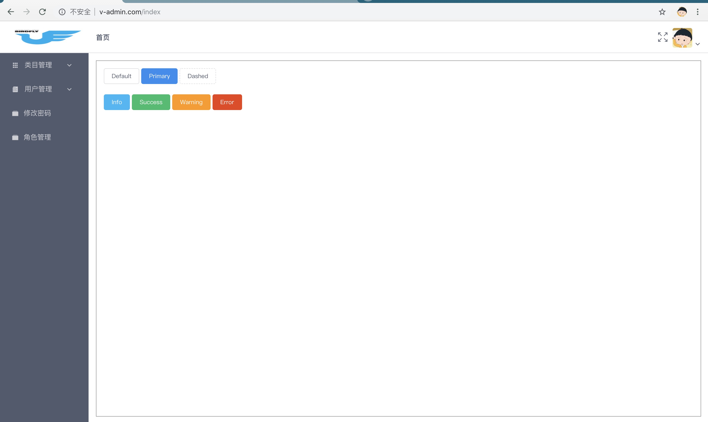

> v-admin based Vue.js by kokiy

### 基于[vue-element-admin](https://github.com/PanJiaChen/vue-element-admin)改造

### 页面布局基于 flex

## 个人见解处理数据流三种处理方式(以正确合理的姿势使用 store)

1. 组件或当前页面独享的,直接 promise 回该组件或页面
2. 组件之间共享的数据,包括(父子组件,兄弟组件,子孙组件,同级组件等等)又分两种情况

- 2.1 同步数据,直接 commit 入 store
- 2.2 异步数据, dispatch 触发 commit 入 store

## Build Setup

```bash
# install dependencies
npm install

# serve with hot reload at localhost:8080
npm run dev

# build for production with minification
npm run build

# build for production and view the bundle analyzer report
npm run build --report
```

### 效果图


